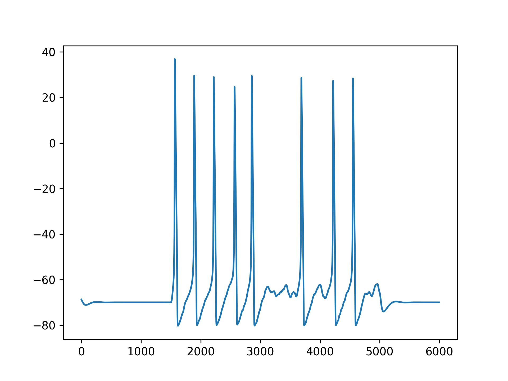

## Spiking Neural Network

The main structure of the model: 
- 22.10.2024: Initial Commit
    yay

# Current (until 15.01): 
- The neurons and networks are working okay.
- Ligand-gated and ion channels are added (should we add more or probably not)

# Next Step:
- Find parameters, with MCMC or with interactive plot, Q: what is a good firing pattern and does it differ with different types or functions of neurons.
- Normalise weights
- Q: should we find if the implemented equtaions are good or not?
- Weight update rules, implement them biologically or mathmetically.
- what kind of trials can we run?
- how many neurons and layers should we have?
- if we use large amount of neurons, can we do population distribution and try bayesian. Actually can we just prove it with simple model? how to add neuron activities? 
- following the last q, should we have a storage room for prior firing? like hippocampus structure but just storing the firing 
- which above should we do first?
- what is the goal? do we do benchmarkings with different dataset like computer science with the old trials OR we do behavior science with population firing.
- should we do more time serial dataset training (because that's what SNN is good at)

# Mar 2025
Adding threshold is a must, because without it if the neuron receives too many ampa current from presynapses the refractory period will be gone like this graph.  Same thing also happens if there is only ion channels. 

It is the AMPA receptor injects current that makes the membrane potential to reach the ion channel firing level. So the threshold should be -58 mV.

When should the firing pattern be the same? The absolute and relative refractory period is very vague, i guess it depends on the ability of sodium channel recovery ability and each person varies. Maybe we can try to see which one performs the best with some training data. 

The ampa current is around 10 each and sodium channel during action potential is around 800. If there are 10 presynapse ampa connected to the same neuron, it can have an influence on the action potential (makes the maximum increase from normal 40 to 60 but that's it). If it is not on the same scale as the sodium 800 current then it does not matter actually. 

# 11 Mar 2025
After detach the ampa current right after reaching threshold -58(12)mV, there are small bumps which are not really fired. Like this . The reason is the states of the gates change with a delay. . So when one action potential finishes, the state is not fully recovered and can influence the next firing threshold. 